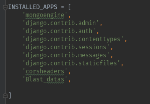
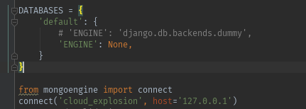
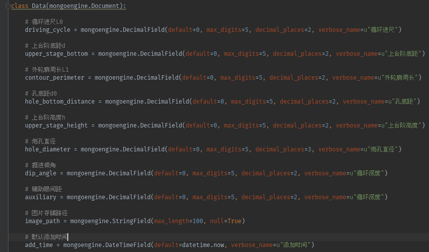

之前学习使用Django搭建在线教育平台使用的是Mysql数据库，现在考虑到公司以后的发展及当前技术需求，更换为MongoDB数据库。在此记录一下更改操作：  

* 1 首先安装mongoengine，并在setting中设置对应的位置  
    
    pip instal mongoengine

* 2 设置默认的数据库信息  

  
* 3 设置Model

  

### 总结

之前因为使用Django自带的admin后台管理系统，所以在像Mysql一样迁移数据库时出现错误。后来分析发现，目前使用Django所做的工作不需要用到后台管理系统，仅仅是作为一个后台服务，因此可直接运行。至此，设置完成。
