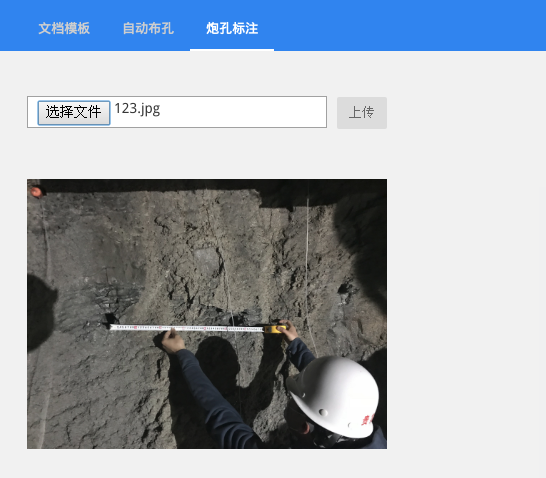
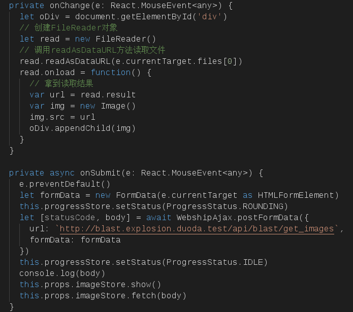
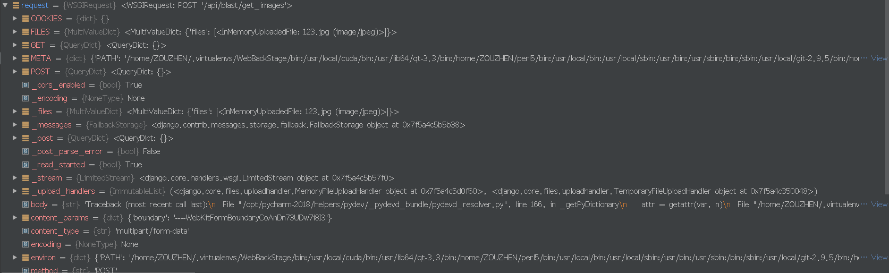
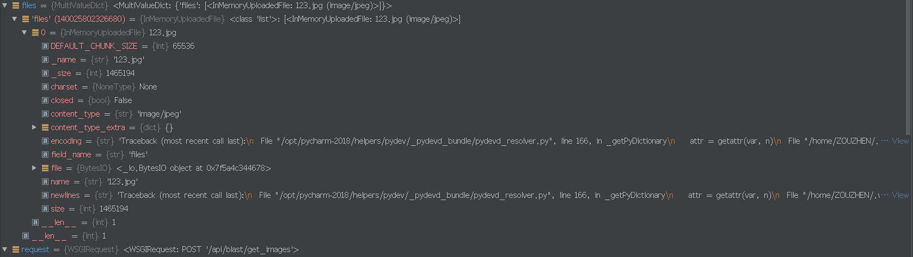
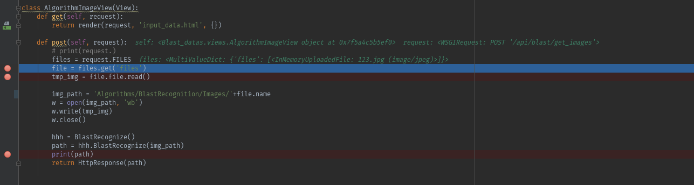

## Nodejs与Django图片信息传输

由于公司需要Nodejs的前端与Django的后端进行交互，其中涉及到图片信息作为二进制流传输，在此记录前后端分离中二进制图片在Django中的保存与转换。

---

### Nodejs中的数据传输

**Nodejs采用Input插件读取图片**  

**其中涉及到公司大牛写的Webship框架，但传送数据的方式没有大的改变**  

### **Django保存传输的二进制图片**

首先，我们分析request请求中所包含的信息：  

  
通过分析，发现request中FILES属性是前端发给我们的包含图片信息的内容，我们取出FILES属性中的内容赋值给files，再进行分析，看我们需要的图片究竟是什么样的内容和格式，内容如下：  

  

可以发现，files变量中包含name属性，即我提交的图片名字，还有一个file属性，其是一个bytes格式的变量入口，这个可能就是我需要的二进制图片，经过测试，读取这个file属性得到的二进制流和我以‘rb’模式read()提交的同一个图片所得到的二进制流相等。  
**至此，就找到了requst中所包含的图片信息，然后将其保存到指定路径中：**  

  

**完成！**