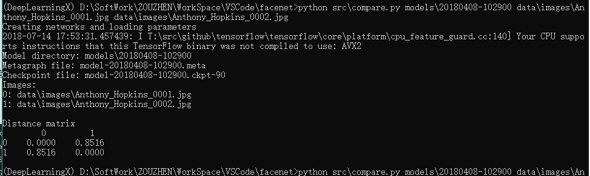

## facenet算法初测  

* [facenet代码地址](https://github.com/davidsandberg/facenet)

* [数据对齐详解](https://www.cnblogs.com/bakari/archive/2012/08/27/2658956.html)

* [已训练模型下载(基于CASIA-WebFace)](https://drive.google.com/file/d/1R77HmFADxe87GmoLwzfgMu_HY0IhcyBz/view)

* [主要参考博客](https://blog.csdn.net/u013044310/article/details/79556099)
---
### 算法代码结构

结构如图：  
  
 
- |—— contribute (包含对人脸进行处理的函数)  

- |—— data (原算法进行训练或测试时使用的图片数据)  

- |—— lfw (储存的lfw数据集)  

- |—— lfw_mtcnnpy_160 (储存的经过对齐后的图片数据)  

- |—— models (存储训练模型)  

- |—— src (核心功能相关的代码)  

- |—— test (算法、模型测试相关的代码)  

- |—— tmp (暂不清楚)  

- |—— 其他  

---
### 功能测试  

- 预训练模型测试：  

        python src/validate_on_lfw.py lfw_mtcnnpy_160 models\20180408-102900  

  

然而测试结果并不是特别好，可能是仅用CPU的缘故  

- 相似人脸对比结果：  

        python src\compare.py models\20180408-102900 data\images\Anthony_Hopkins_0001.jpg data\images\Anthony_Hopkins_0002.jpg  

  

- 不相似人脸对比结果：  

        python src\compare.py models\20180408-102900 data\images\Anthony_Hopkins_0001.jpg lfw_mtcnnpy_160\Aaron_Eckhart\Aaron_Eckhart_0001.png

