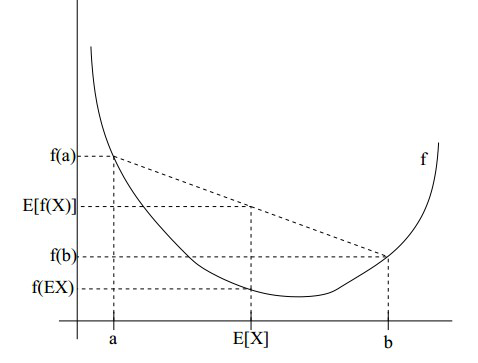

# EM算法

## EM简介
EM(Expectation Mmaximization) 是一种迭代算法， 用于含隐变量(Latent Variable) 的概率模型参数的极大似然估计， 或极大后验概率估计 EM算法由两步组成， 求期望的E步，和求极大的M步。  
EM算法可以看成是特殊情况下计算极大似然的一种算法。现实的数据经常有一些比较奇怪的问题，比如缺失数据、含有隐变量等问题。当这些问题出现的时候，计算极大似然函数通常是比较困难的，而EM算法可以解决这个问题。

EM算法已经有很多应用，比如最经典的Hidden Markov模型等。经济学中，除了逐渐开始受到重视的HMM模型（例如Yin and Zhao, 2015），其他领域也有可能涉及到EM算法，比如在Train的《Discrete Choice Methods with Simulation》就给出了一个 $mixed logit$ 模型的EM算法。

## EM算法的预备知识  

1. 极大似然估计

    1. 1  举例说明：经典问题——学生身高问题  

    我们需要调查我们学校的男生和女生的身高分布。 假设你在校园里随便找了100个男生和100个女生。他们共200个人。将他们按照性别划分为两组，然后先统计抽样得到的100个男生的身高。假设他们的身高是服从高斯分布的。但是这个分布的均值u和方差∂2我们不知道，这两个参数就是我们要估计的。记作θ=[u, ∂]T。  
    问题：我们知道样本所服从的概率分布的模型和一些样本，而不知道该模型中的参数。  
    我们已知的有两个：（1）样本服从的分布模型（2）随机抽取的样本  需要通过极大似然估计求出的包括：模型的参数  
    总的来说：极大似然估计就是用来估计模型参数的统计学方法。 

    2. 2  如何估计  

    问题数学化：
    - (1)样本集: x={$x_1,x_2,…,x_N$}, $N=100$。
    - (2)概率密度：$p(x_i|\theta)$ 抽到男生$i$（的身高）的概率 100个样本之间独立同分布，所以我同时抽到这100个男生的概率就是他们各自概率的乘积。就是从分布是$p(x|\theta)$ 的总体样本中抽取到这100个样本的概率，也就是样本集X中各个样本的联合概率，用下式表示：  
    $$L(\theta)=L(x_1,...,x_n;\theta)=\prod_{i=1}^n{p(x_i|\theta)},\theta\in\phi$$  
    这个概率反映了，在概率密度函数的参数是$\theta$时，得到X这组样本的概率。 需要找到一个参数θ，其对应的似然函数$L(\theta)$最大，也就是说抽到这100个男生（的身高）概率最大。这个叫做$\theta$的最大似然估计量，记为  
    $$argmaxL(\theta)$$  

    3. 3  求最大似然函数估计值的一般步骤  
    
    首先，写出似然函数：  
    $$L(\theta)=L(x_1,...,x_n;\theta)=\prod_{i=1}^n{p(x_i|\theta)},\theta\in\phi$$  
    其次，对似然函数取对数，并整理：  
    $$H(\theta)=lnL(\theta)=ln\prod_{i=1}^n{p(x_i|\theta)}=\sum_{i=1}^n{lnp(x_i|\theta)}$$  
    然后，求导数，令导数为0，得到似然方程；最后，解似然方程，得到的参数即为所求。

    4. 4  总结  

    多数情况下我们是根据已知条件来推算结果，而极大似然估计是已经知道了结果，然后寻求使该结果出现的可能性最大的条件，以此作为估计值。
 
