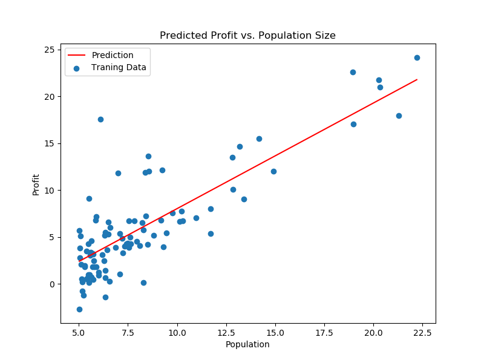

## **线性回归**

### **简述**

在统计学中，线性回归（Linear Regression）是利用称为线性回归方程的最小平方函数对一个或多个自变量和因变量之间关系进行建模的一种回归分析。这种函数是一个或多个称为回归系数的模型参数的线性组合（自变量都是一次方）。只有一个自变量的情况称为简单回归，大于一个自变量情况的叫做多元回归。简单来说，就是找到一条直线去拟合数据点。如下图：


优点：结果易于理解，计算上不复杂。  
缺点：对非线性数据拟合不好。  
适用数据类型：数值型和标称型数据。  
算法类型：回归算法

线性回归的模型函数如下：  

$$h_\theta = \theta^Tx$$  

它的损失函数如下：  

$$J(\theta) = \frac{1}{2m}\sum_{i=1}^m(h_\theta(x^i)-y^i)^2$$  

通过训练数据集寻找参数的最优解，即求解可以得到$minJ(θ)$的参数向量$θ$,其中这里的参数向量也可以分为参数和$w$和$b$,分别表示权重和偏置值。
求解最优解的方法有最小二乘法和梯度下降法。
- **梯度下降法**  
    梯度下降算法的思想如下(这里以一元线性回归为例)：

    首先，我们有一个代价函数，假设是$J(θ_0,θ_1)$，我们的目标是$minθ_0,θ_1 J(θ_0,θ_1)$。 
    接下来的做法是：

    - 首先是随机选择一个参数的组合$(θ_0,θ_1)$,一般是设$θ_0=0,θ_1=0$;
    - 然后是不断改变$(θ_0,θ_1)$，并计算代价函数，直到一个局部最小值。之所以是局部最小值，是因为我们并没有尝试完所有的参数组合，所以不能确定我们得到的局部最小值是否便是全局最小值，选择不同的初始参数组合，可能会找到不同的局部最小值。 
    下面给出梯度下降算法的公式：
    repeat until convergence{

        $$\theta_j := \theta_j - \alpha\frac{\partial}{\partial\theta_j}J(θ_0,θ_1)(for j =0 and j=1)$$  
    }
    也就是在梯度下降中，不断重复上述公式直到收敛，也就是找到局部最小值局部最小值。其中符号$:=$是赋值符号的意思。
    - 而应用梯度下降法到线性回归，则公式如下：  

    $$\theta_0 := \theta_0 - \alpha\frac{1}{2m}\sum_{i=1}^m(h_\theta(x^i)-y^i)^2$$  
    $$\theta_1 := \theta_1 - \alpha\frac{1}{2m}\sum_{i=1}^m((h_\theta(x^i)-y^i)\cdot x^i)^2$$  

    公式中的$\alpha$称为学习率(learning rate)，它决定了我们沿着能让代价函数下降程度最大的
    方向向下迈进的步子有多大。
    在梯度下降中，还涉及都一个参数更新的问题，即更新$(\theta_0,\theta_1)$,一般我们的做法是同步更新. 
    最后，上述梯度下降算法公式实际上是一个叫**批量梯度下降(batch gradient descent)**，即它在每次梯度下降中都是使用整个训练集的数据，
    所以公式中是带有$ \sum_{i=1}^m $.

- **岭回归（ridge regression）**  
    岭回归是一种专用于共线性数据分析的有偏估计回归方法，实质上是一种改良的最小二乘估计法，通过放弃最小二乘法的无偏性，以损失部分信息、降低精度为代价，获得回归系数更为符合实际、更可靠的回归方法，对病态数据的耐受性远远强于最小二乘法。

    岭回归分析法是从根本上消除复共线性影响的统计方法。岭回归模型通过在相关矩阵中引入一个很小的岭参数$K（1>K>0）$，并将它加到主对角线元素上，从而降低参数的最小二乘估计中复共线特征向量的影响，减小复共线变量系数最小二乘估计的方法，以保证参数估计更接近真实情况。岭回归分析将所有的变量引入模型中，比逐步回归分析提供更多的信息。

### **代码实现**  

- 使用sklearn包中的线性回归算法
```py
import matplotlib.pyplot as plt
import numpy as np
from sklearn import datasets, linear_model
from sklearn.metrics import mean_squared_error, r2_score

# Load the diabetes dataset
diabetes = datasets.load_diabetes()


# Use only one feature
diabetes_X = diabetes.data[:, np.newaxis, 2]

# Split the data into training/testing sets
diabetes_X_train = diabetes_X[:-20]
diabetes_X_test = diabetes_X[-20:]

# Split the targets into training/testing sets
diabetes_y_train = diabetes.target[:-20]
diabetes_y_test = diabetes.target[-20:]

# Create linear regression object
regr = linear_model.LinearRegression()

# Train the model using the training sets
regr.fit(diabetes_X_train, diabetes_y_train)

# Make predictions using the testing set
diabetes_y_pred = regr.predict(diabetes_X_test)

# The coefficients
print('Coefficients: \n', regr.coef_)
# The mean squared error
print("Mean squared error: %.2f"
      % mean_squared_error(diabetes_y_test, diabetes_y_pred))
# Explained variance score: 1 is perfect prediction
print('Variance score: %.2f' % r2_score(diabetes_y_test, diabetes_y_pred))

# Plot outputs
plt.scatter(diabetes_X_test, diabetes_y_test,  color='black')
plt.plot(diabetes_X_test, diabetes_y_pred, color='blue', linewidth=3)

plt.xticks(())
plt.yticks(())

plt.show()
```

- 使用代码实现算法
```py
import os
import numpy as np
import pandas as pd
import matplotlib.pylab as plt
from sklearn import linear_model

# 计算损失函数
def computeCost(X, y, theta):
    inner = np.power(((X * theta.T) - y), 2)
    return np.sum(inner) / (2 * len(X))

# 梯度下降算法
def gradientDescent(X, y, theta, alpha, iters):
    temp = np.matrix(np.zeros(theta.shape))
    parameters = int(theta.ravel().shape[1])
    cost = np.zeros(iters)

    for i in range(iters):
        error = (X * theta.T) - y

        for j in range(parameters):
            # 计算误差对权值的偏导数
            term = np.multiply(error, X[:, j])
            # 更新权值
            temp[0, j] = theta[0, j] - ((alpha / len(X)) * np.sum(term))

        theta = temp
        cost[i] = computeCost(X, y, theta)
    return theta, cost

dataPath = os.path.join('data', 'ex1data1.txt')
data = pd.read_csv(dataPath, header=None, names=['Population', 'Profit'])
# print(data.head())
# print(data.describe())
# data.plot(kind='scatter', x='Population', y='Profit', figsize=(12, 8))
# 在数据起始位置添加1列数值为1的数据
data.insert(0, 'Ones', 1)
print(data.shape)

cols = data.shape[1]
X = data.iloc[:, 0:cols-1]
y = data.iloc[:, cols-1:cols]

# 从数据帧转换成numpy的矩阵格式
X = np.matrix(X.values)
y = np.matrix(y.values)
# theta = np.matrix(np.array([0, 0]))
theta = np.matrix(np.zeros((1, cols-1)))
print(theta)
print(X.shape, theta.shape, y.shape)
cost = computeCost(X, y, theta)
print("cost = ", cost)

# 初始化学习率和迭代次数
alpha = 0.01
iters = 1000

# 执行梯度下降算法
g, cost = gradientDescent(X, y, theta, alpha, iters)
print(g)

# 可视化结果
x = np.linspace(data.Population.min(),data.Population.max(),100)
f = g[0, 0] + (g[0, 1] * x)

fig, ax = plt.subplots(figsize=(12, 8))
ax.plot(x, f, 'r', label='Prediction')
ax.scatter(data.Population, data.Profit, label='Training Data')
ax.legend(loc=2)
ax.set_xlabel('Population')
ax.set_ylabel('Profit')
ax.set_title('Predicted Profit vs. Population Size')

fig, ax = plt.subplots(figsize=(12, 8))
ax.plot(np.arange(iters), cost, 'r')
ax.set_xlabel('Iteration')
ax.set_ylabel('Cost')
ax.set_title('Error vs. Training Epoch')


# 使用sklearn 包里面实现的线性回归算法
model = linear_model.LinearRegression()
model.fit(X, y)

x = np.array(X[:, 1].A1)
# 预测结果
f = model.predict(X).flatten()
# 可视化
fig, ax = plt.subplots(figsize=(12, 8))
ax.plot(x, f, 'r', label='Prediction')
ax.scatter(data.Population, data.Profit, label='Training Data')
ax.legend(loc=2)
ax.set_xlabel('Population')
ax.set_ylabel('Profit')
ax.set_title('Predicted Profit vs. Population Size(using sklearn)')
plt.show()
```