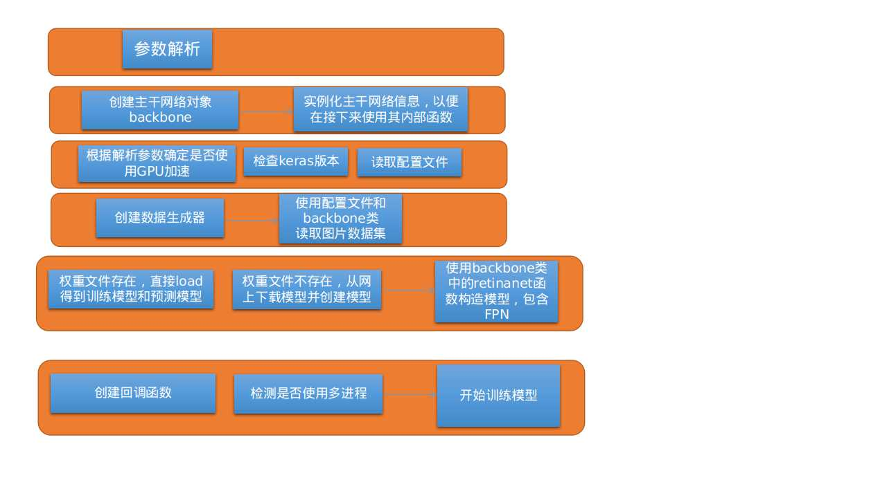

# 框架梳理——RetinaNet/keras

代码地址：https://travis-ci.org/fizyr/keras-retinanet

## 文件目录

- keras-retinanet  

    │  
    ├── examples(例图和测试Notebook)   
    │  
    ├── images(测试图片)   
    │  
    ├── keras_retinanet(主要的框架代码)   
    │  
    ├── snapshots(模型保存地址)   
    │  
    └── tests(测试文件夹，包含对模型的各种测试)

- keras_retinanet(主要的框架代码)  
    │  
    ├── backend(tf或者th相关的设置)   
    │  
    ├── bin(包含模型转换、调试、评价、训练等文件)   
    │  
    ├── callbacks(与召回相关的函数)   
    │  
    ├── layers(基础网络层之上的采样层处理，过滤预选框)   
    │  
    ├── callbacks(与召回相关的函数)   
    │  
    ├── models(基础网络文件夹，包括densenet、mobilenet、resnet、retinanet、vgg等网络)   
    │  
    ├── preprocessing(数据集相关，包括各种数据集的获取、解析等)   
    │  
    ├── utils(附属工具，包括锚点框、非最大值抑制等)   
    │  
    └── losses.py/initializers.py(损失和初始化等)

## 训练模型

关于模型的训练文件，在bin文件夹下，其训练文件的流程大致如下

