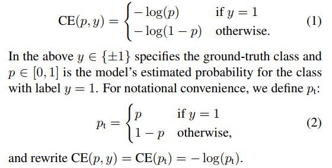
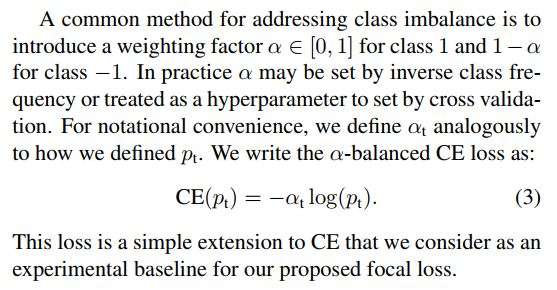
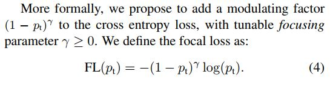
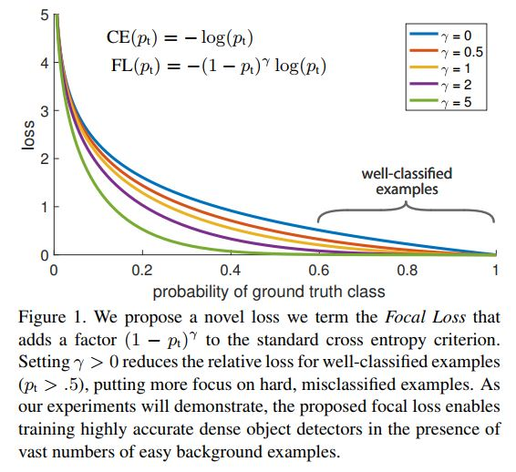
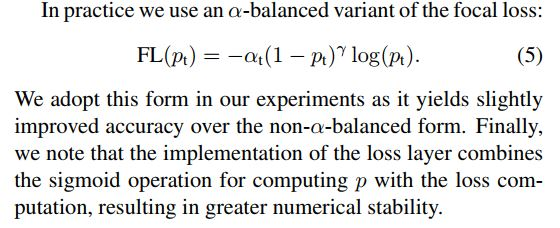
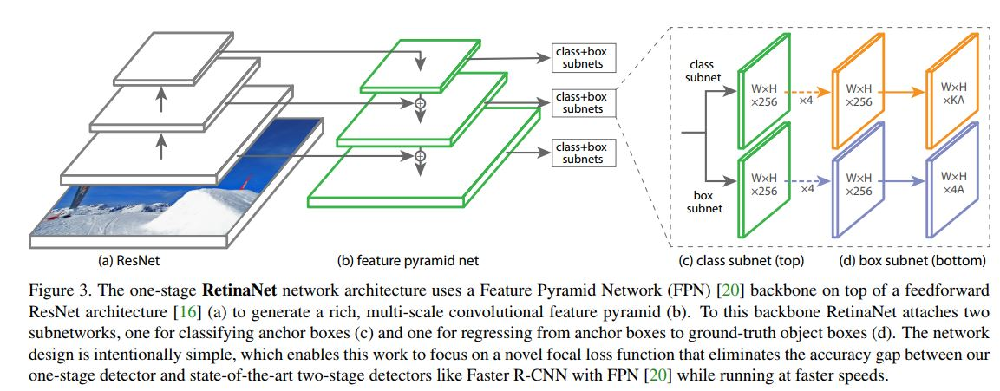
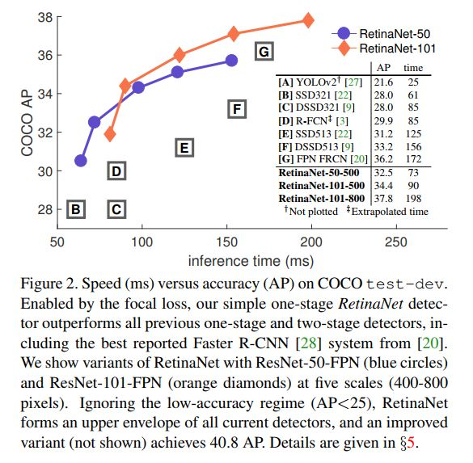

转载自：https://www.jianshu.com/p/8e501a159b28 如有侵权，请联系删除

# RetinaNet: Focal loss在目标检测网络中的应用

## 介绍
RetinaNet是2018年Facebook AI团队在目标检测领域新的贡献。它的重要作者名单中Ross Girshick与Kaiming He赫然在列。来自Microsoft的Sun Jian团队与现在Facebook的Ross/Kaiming团队在当前视觉目标分类、检测领域有着北乔峰、南慕容一般的独特地位。这两个实验室的文章多是行业里前进方向的提示牌。
RetinaNet只是原来FPN网络与FCN网络的组合应用，因此在目标网络检测框架上它并无特别亮眼创新。文章中最大的创新来自于Focal loss的提出及在单阶段目标检测网络RetinaNet（实质为Resnet + FPN + FCN）的成功应用。Focal loss是一种改进了的交叉熵(cross-entropy, CE)loss，它通过在原有的CE loss上乘了个使易检测目标对模型训练贡献削弱的指数式，从而使得Focal loss成功地解决了在目标检测时，正负样本区域极不平衡而目标检测loss易被大批量负样本所左右的问题。此问题是单阶段目标检测框架（如SSD/Yolo系列）与双阶段目标检测框架（如Faster-RCNN/R-FCN等）accuracy gap的最大原因。在Focal loss提出之前，已有的目标检测网络都是通过像Boot strapping/Hard example mining等方法来解决此问题的。作者通过后续实验成功表明Focal loss可在单阶段目标检测网络中成功使用，并最终能以更快的速率实现与双阶段目标检测网络近似或更优的效果。

## 类别不平衡问题

常规的单阶段目标检测网络像SSD一般在模型训练时会先大密度地在模型终端的系列feature maps上生成出10,000甚至100,0000个目标候选区域。然后再分别对这些候选区域进行分类与位置回归识别。而在这些生成的数万个候选区域中，绝大多数都是不包含待检测目标的图片背景，这样就造成了机器学习中经典的训练样本正负不平衡的问题。它往往会造成最终算出的training loss为占绝对多数但包含信息量却很少的负样本所支配，少样正样本提供的关键信息却不能在一般所用的training loss中发挥正常作用，从而无法得出一个能对模型训练提供正确指导的loss。
常用的解决此问题的方法就是负样本挖掘。或其它更复杂的用于过滤负样本从而使正负样本数维持一定比率的样本取样方法。而在此篇文章中作者提出了可通过候选区域包含潜在目标概率进而对最终的training loss进行较正的方法。实验表明这种新提出的focal loss在单阶段目标检测任务上表现突出，有效地解决了此领域里面潜在的类别不平衡问题。

## Focal loss

- CE(cross-entropy) loss  
    以下为典型的交叉熵loss，它广泛用于当下的图像分类、检测CNN网络当中。

    

- Balanced CE loss  
    考虑到上节中提到的类别不平衡问题对最终training loss的不利影响，我们自然会想到可通过在loss公式中使用与目标存在概率成反比的系数对其进行较正。如下公式即是此朴素想法的体现。它也是作者最终Focus loss的baseline。

    

- Focal loss定义  
    以下是作者提出的focal loss的想法。

    
    下图为focal loss与常规CE loss的对比。从中，我们易看出focal loss所加的指数式系数可对正负样本对loss的贡献自动调节。当某样本类别比较明确些，它对整体loss的贡献就比较少；而若某样本类别不易区分，则对整体loss的贡献就相对偏大。这样得到的loss最终将集中精力去诱导模型去努力分辨那些难分的目标类别，于是就有效提升了整体的目标检测准度。不过在此focus loss计算当中，我们引入了一个新的hyper parameter即γ。一般来说新参数的引入，往往会伴随着模型使用难度的增加。在本文中，作者有试者对其进行调节，线性搜索后得出将γ设为2时，模型检测效果最好。

    

    在最终所用的focal loss上，作者还引入了α系数，它能够使得focal loss对不同类别更加平衡。实验表明它会比原始的focal loss效果更好。

    

## 模型的初始化参数选择

一般我们初始化CNN网络模型时都会使用无偏的参数对其初始化，比如Conv的kernel 参数我们会以bias 为0，variance为0.01的某分布来对其初始化。但是如果我们的模型要去处理类别极度不平衡的情况，那么就会考虑到这样对训练数据分布无任选先验假设的初始化会使得在训练过程中，我们的参数更偏向于拥有更多数量的负样本的情况去进化。作者观察下来发现它在训练时会出现极度的不稳定。于是作者在初始化模型最后一层参数时考虑了数据样本分布的不平衡性，这样使得初始训练时最终得出的loss不会对过多的负样本数量所惊讶到，从而有效地规避了初始训练时模型的震荡与不稳定

## RetinaNet检测框架

RetinaNet本质上是Resnet + FPN + 两个FCN子网络。
以下为RetinaNet目标框架框架图。有了之前blog里面提到的FPN与FCN的知识后，我们很容易理解此框架的设计含义。

一般主干网络可选用任一有效的特征提取网络如vgg16或resnet系列，此处作者分别尝试了resnet-50与resnet-101。而FPN则是对resnet-50里面自动形成的多尺度特征进行了强化利用，从而得到了表达力更强、包含多尺度目标区域信息的feature maps集合。最后在FPN所吐出的feature maps集合上，分别使用了两个FCN子网络（它们有着相同的网络结构却各自独立，并不share参数）用来完成目标框类别分类与位置回归任务。

## 模型的推理与训练

- 模型推理 

    一旦我们有了训练好的模型，在正式部署时，只需对其作一次forward，然后对最终生成的目标区域进行过渡。然后只对每个FPN level上目标存在概率最高的前1000个目标框进一步地decoding处理。接下来再将所有FPN level上得到的目标框汇集起来，统一使用极大值抑制的方法进一步过渡（其中极大值抑制时所用的阈值为0.5）。这样，我们就得到了最终的目标与其位置框架。

- 模型训练

    模型训练中主要在后端Loss计算时采用了Focal loss，另外也在模型初始化时考虑到了正负样本极度不平衡的情况进而对模型最后一个conv layer的bias参数作了有偏初始化。 

    训练时用了SGD，mini batch size为16，在8个GPU上一块训练，每个GPU上local batch size为2。最大iterations数目为90,000；模型初始lr为0.01,接下来随着训练进行分step wisely 降低。真正的training loss则为表达目标类别的focus loss与表达目标框位置回归信息的L1 loss的和。  

    下图为RetinaNet模型的检测准度与性能
    

