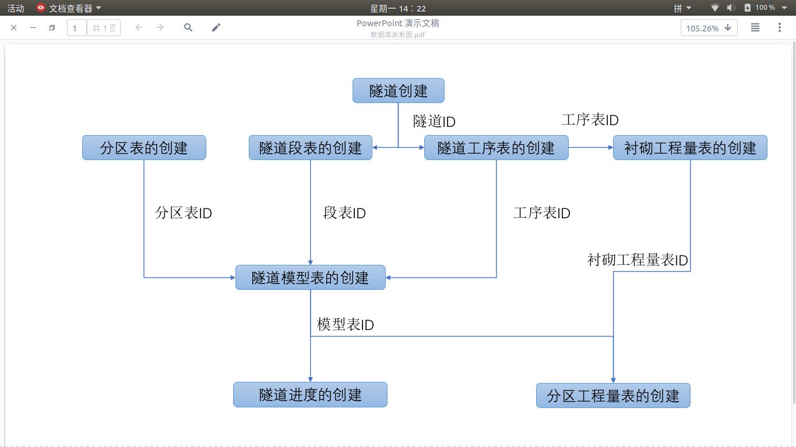

# 渝黔高速——隧道

开发工具：JavaScript + Git + Docker + Postgresql  
IDE：Vscode

表结构设计：

- 隧道表
- 衬砌表
- 工法分区表
- 衬砌工程量表
- 分区工程量表
- 模型表
- 进度表
- 施工劳务记录表
- 劳务合同清单表

## 业务分析

### 模型的创建  

- 隧道的创建以及获取信息
- 衬砌的创建以及信息获取
- 工法分区的创建以及信息获取
- 衬砌工程量的录入
- 隧道段的创建、查询、修改
- 在段下面创建模型（根据衬砌类型和分区批量创建）
- 分区工程量参数设置（根据已经创建的模型，对每一个分区进行分区工程量参数设置）、修改
- 分区工程量参数

### 进度

- 根据模型获取相关的工程量，起止桩号
- 创建进尺
- 修改完成状态
- 查看已完成进尺

### 工程量

- 统计当前施工完成的工程量
- 根据时间筛选当前完成的工程量

### 产值

- 根据工程量计算得到当前施工的总产值以及单个隧道产值

### 分包

- 合同工程量清单的创建、获取
- 劳务成本的计算

### 业务逻辑

